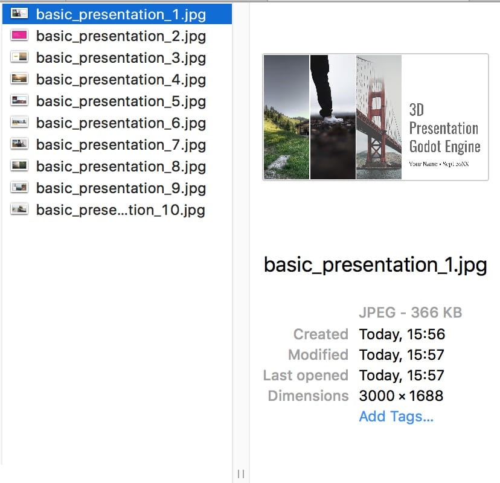
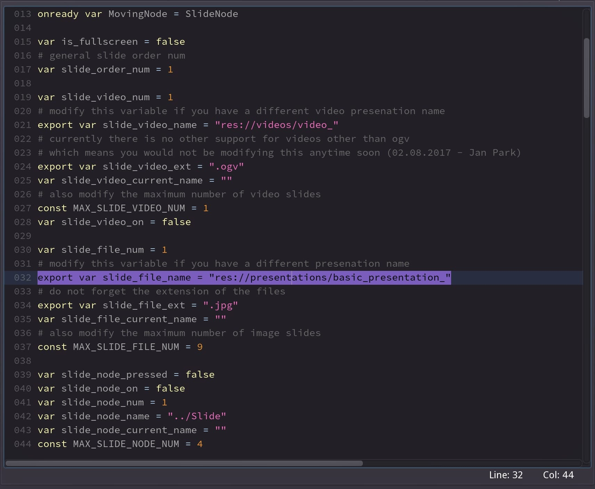
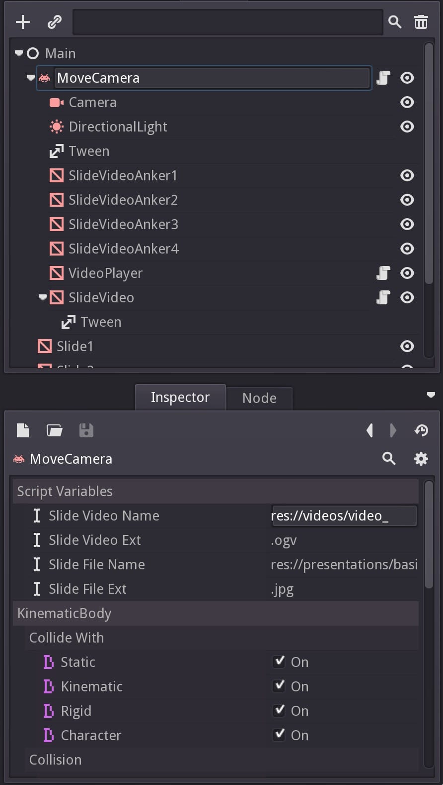
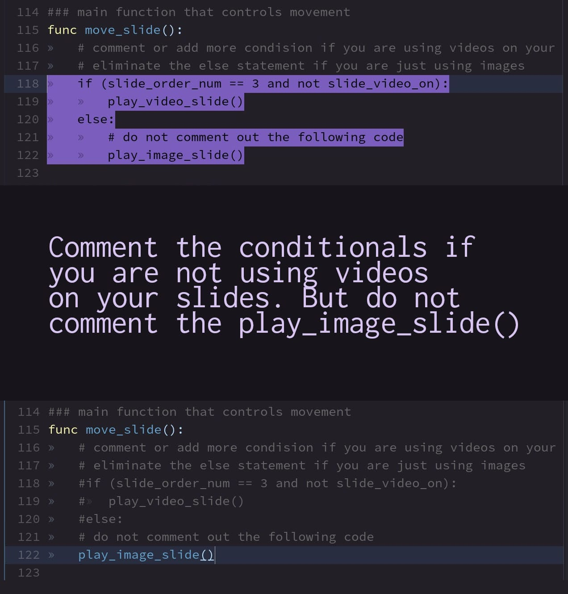

# 3D Presentation for Godot Engine

An open source 3d slide presentation made in the Godot Engine

## Demos

- macOS: [3DPresenationGodotDemo_mac.zip](demos/3DPresenationGodotDemo_mac.zip)
- windows: [3DPresenationGodotDemo_win.zip](demos/3DPresenationGodotDemo_win.zip)
- linux (untested): [3DPresenationGodotDemo_linux.zip](demos/3DPresenationGodotDemo_linux.zip)

## Supports

Images and Video Textures.
Environmental features and colors

Suitable for slides without inner animations, basically 1 slide = 1 image.
Does not support dynamic text or content (yet)?
Feel free to push builds, fork it, and use it for personal or professional projects.

### Requirements
- Godot Engine 2.1.3+
- Tested on Godot Engine 2.1.4 beta
- Does not work on Godot Engine 3.0 alpha

### Getting started
<ol>
<li>Export your presenation to a PDF format.</li>
<li>Convert your PDF to separate images, I recommend using [Freepdfconvert.com/pdf-jpg](https://www.freepdfconvert.com/pdf-jpg)</li>
<li>Rename every slide the same with a numeric identifier, this will also define the order, do not use extra zeros just single numbers. Example: do `image-1.jpg` instead of `image-00001.jpg`.</li>

<li>Open the Godot project and modify the `MoveCamera.gd` file. Located in the scripts directory `res://scripts/MoveCamera.gd`</li>
<li>Modify the number of slides and the base name of the presentations. They are available through code or through the inspector.</li>

<li>Comment the video conditionals if you are not using them.</li>

</ol>
<li>Play and test the scene. You are also able to modify the angle of the preseted Slide Objects. Just do not rename the objects you can create as many or as little as youo want. But, remember to always set the max number on the script again.

### Adding video slides
To add your own videos you'll need to convert them to OGV, which is as of this writing the only supported video format on Godot Engine.

My recommendation is using ffmpeg2theora, a free CLI converter. It's also the fastest and with the best results, I've found. Look below this section to find the recommendations for the different operating systems.
Visit ffmpeg2theora page [http://v2v.cc/~j/ffmpeg2theora/](http://v2v.cc/~j/ffmpeg2theora/)

- Add the videos to the `videos` folder under `res://videos/`
- Make sure you rename them just as the image slides with a numeric identifier.
- Add a maximum number through code or the inspector on `MoveCamera.gd` on the MoveCamera Object.
- And most also very important remember to add an order in which they should be reproduced.
- Done!

#### DO NOT FORGET:
- Set the maximum number of slides you are using, otherwise, they may not show up correctly.
- Comment the video conditionals if you are not using any videos on your presentation.
- If you are adding more slide object or getting rid of some, also modify the code to avoid unintentional behaviors.

#### macOS (Theora video converter)
Follow the steps recorded on this page:
[http://macappstore.org/ffmpeg2theora/](http://macappstore.org/ffmpeg2theora/)

#### Windows and Linux (Theora video converter)
Download the appropriate executable and follow the :
[http://v2v.cc/~j/ffmpeg2theora/download.html](http://v2v.cc/~j/ffmpeg2theora/download.html)

### License
- MIT License
- Feel free to use the videos and slides
- The icon.png is the only thing that requires mention.

#### External Resources
- Icon modified. <em>Presentation free icon</em>. Madebyoliver. Retrived from https://www.flaticon.com/free-icon/presentation_138322

- Deer Video. <em>deer-lincoln-national-forest_prores</em>. Public Domain. Retrieved from https://www.pond5.com/stock-footage/44576109/deer-lincoln-national-forest.html

- Demo Slides. <em>Google Slides Photo Template</em>. Google Slides. Retrieved from https://docs.google.com/presentation/

### Features for future implementation ideas.
> feel free to implement them and merge them to this repository.

- Upload your Powerpoint file and spit out a dynamic presentation.
- Add 3D animation templates and different transitions available.
- Dynamic WorldEnvironment modification (examples: color interpolation from green to blue, loops, 3D environment backgrounds...).
- Custom logo that would be published under the MIT license too.